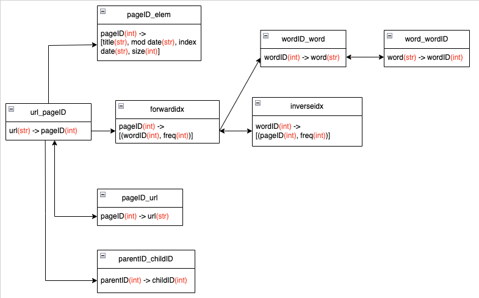

# COMP4321: Search Engines for Web and Enterprise Data Final project
## Set up

#### 1. Setup preferred Virtual env (optional)
- Packages must be installed, loading them into a virtual env would make it easier to delete them later. 

#### 1.5 Install pip (optional)
- Only required if pip is not already installed. 
- Mac/Linux: `python get-pip.py`
- Windows: `py get-pip.py`

#### 2. Pip install packages
- Using pip, install packages (into virtual env). 
- `pip install sqlitedict bs4 requests nltk python-dateutil django`

#### 3. Run crawler.py to crawl page
- `python crawler.py`

#### 4. Run tfidf.py to calculate document term weights
- ‘python tfidf.py’

#### 5. move into mysite dir
- `cd mysite`
  
#### 6. Runserver with Django
- `python manage.py runserver`
- Search page is at: http://127.0.0.1:8000/

## Schema

## Overall Design
This project was done in Python 3.8.2. The application consists of mainly 3 parts. 
-	The crawler and indexer, that recursively fetches webpages in a BFS manner, stores words, information and child links etc. and other information about the page into the indexes; 
-	The first part of the retrieval function that does the calculation for the term weights in the document indexes
-	The second part of the retrieval function tokenizes and calculates query term weights, and calculates the cosine similarity between query term weights and the already calculated document term weights, then ranks them. 
-	The web server that receives input query, sends the query to the retrieval function and displays results from the retrieval function. 

 ====> **See Report for more details** <====

## Preview

